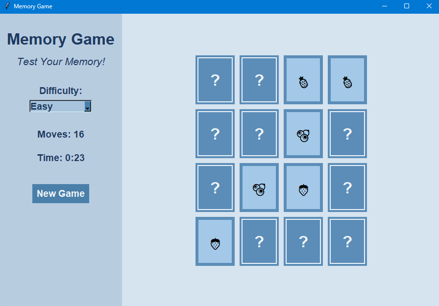

# Memory Game

A card-matching memory game built with Python and Tkinter.

Flip cards to find matching pairs. Match all pairs to win.

## How to Run

```bash
python memory_game.py
```

Requires Python 3 with Tkinter (included in most Python installations).

## Difficulty Levels

- **Easy** — 4×4 grid (8 pairs)
- **Medium** — 4×5 grid (10 pairs)
- **Hard** — 5×6 grid (15 pairs)

## Screenshot


